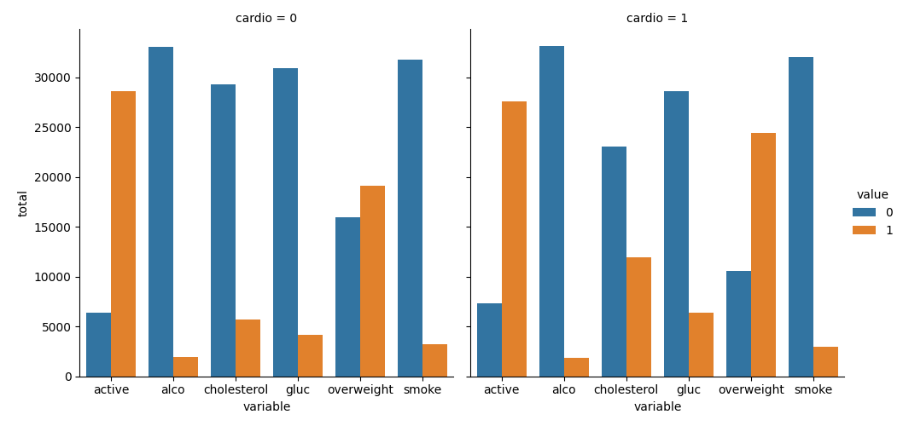
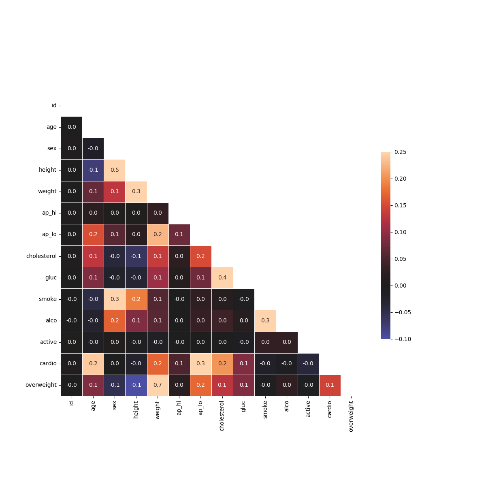

# 🩺 Medical Data Visualizer

## 📊 Overview

Medical Data Visualizer is a data analysis project that explores the relationship between cardiovascular disease, body measurements, biological markers, and lifestyle habits.

Using a dataset containing **70,000 patient records**, this project demonstrates a complete data analysis workflow including data cleaning, feature engineering, statistical exploration, and visualization.

The final output consists of two analytical visualizations that help uncover patterns associated with cardiovascular disease risk factors.

---

## 🎯 Objectives

* Analyze cardiovascular disease risk factors.
* Transform raw medical examination data into meaningful insights.
* Engineer new health-related features from existing measurements.
* Identify relationships between clinical variables and disease outcomes.
* Create professional visualizations for exploratory data analysis.

---

## 📈 Dataset Statistics

| Metric                                  | Value      |
| --------------------------------------- | ---------- |
| Records                                 | 70,000     |
| Features                                | 13         |
| Patients with cardiovascular disease    | 34,979     |
| Patients without cardiovascular disease | 35,021     |
| Dataset balance                         | ~50% / 50% |

### Available Variables

| Category          | Variables                                       |
| ----------------- | ----------------------------------------------- |
| Demographics      | Age, Sex                                        |
| Body Measurements | Height, Weight                                  |
| Blood Pressure    | Systolic (ap_hi), Diastolic (ap_lo)             |
| Blood Markers     | Cholesterol, Glucose                            |
| Lifestyle Factors | Smoking, Alcohol Consumption, Physical Activity |
| Target Variable   | Cardiovascular Disease (cardio)                 |

---

## ⚙️ Data Processing

### 1. Feature Engineering

A new feature called **overweight** was created using the Body Mass Index (BMI):

BMI = Weight (kg) / Height² (m)

Classification:

* BMI ≤ 25 → 0 (Not Overweight)
* BMI > 25 → 1 (Overweight)

### 2. Data Normalization

To simplify analysis:

#### Cholesterol

* Normal → 0
* Above Normal / Well Above Normal → 1

#### Glucose

* Normal → 0
* Above Normal / Well Above Normal → 1

This transformation standardizes variables so that:

* 0 = Healthy / Good
* 1 = Risk Factor / Bad

### 3. Data Cleaning

To improve data quality, inconsistent and extreme observations were removed:

* Diastolic pressure higher than systolic pressure
* Height below the 2.5th percentile
* Height above the 97.5th percentile
* Weight below the 2.5th percentile
* Weight above the 97.5th percentile

This approach reduces noise and improves the reliability of statistical analysis.

---

## 📊 Generated Visualizations

### Categorical Analysis Dashboard

Generated file:

```text
catplot.png
```

This visualization compares the distribution of:

* Cholesterol
* Glucose
* Smoking
* Alcohol consumption
* Physical activity
* Overweight status

Across:

* Patients with cardiovascular disease
* Patients without cardiovascular disease

### Correlation Heatmap

Generated file:

```text
heatmap.png
```

The heatmap displays the correlation matrix between all variables and helps identify:

* Positive correlations
* Negative correlations
* Potential cardiovascular risk indicators
* Relationships between lifestyle factors and medical outcomes

---

## 🖼️ Sample Visualizations

### Categorical Plot



### Correlation Heatmap



---

## 🛠️ Technologies Used

* Python
* Pandas
* NumPy
* Matplotlib
* Seaborn

---

## 💡 Skills Demonstrated

### Data Analysis

* Exploratory Data Analysis (EDA)
* Statistical Analysis
* Correlation Analysis
* Data Interpretation

### Data Processing

* Data Cleaning
* Outlier Detection
* Data Transformation
* Data Normalization
* Feature Engineering

### Data Visualization

* Categorical Charts
* Correlation Heatmaps
* Data Storytelling

### Software Development

* Modular Python Programming
* Automated Testing
* Reproducible Data Analysis Workflows

---

## 📂 Project Structure

```text
medical-data-visualizer/
│
├── medical_data_visualizer.py
├── medical_examination.csv
├── main.py
├── test_module.py
├── README.md
├── .gitignore
│
└── images/
    ├── catplot.png
    └── heatmap.png
```

---

## 🚀 Key Outcomes

✔ Processed and analyzed 70,000 patient records

✔ Engineered health-related features using BMI calculations

✔ Performed data normalization and outlier removal

✔ Built analytical visualizations to investigate cardiovascular disease risk factors

✔ Applied industry-standard Python data analysis tools and workflows

✔ Produced reproducible and scalable data analysis pipelines

